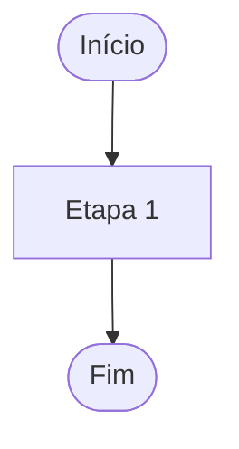
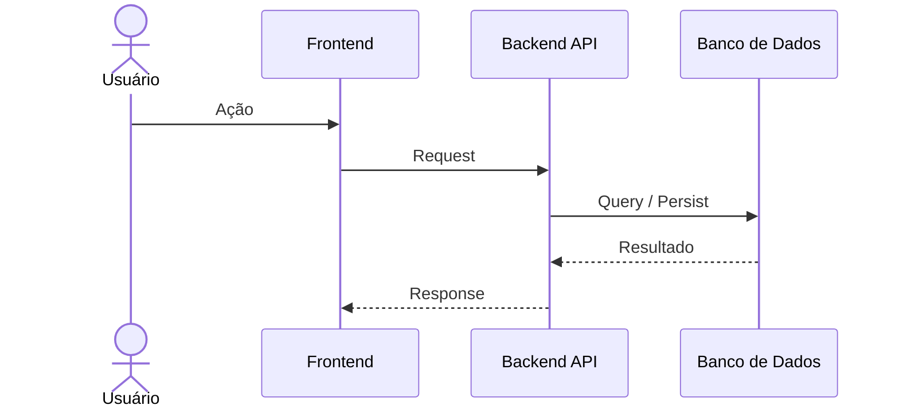

# Fluxos e Diagramas de Sequência

## 1. Fluxo Principal

```mermaid
flowchart TD
  Start([Início]) --> Step1["Etapa 1"]
  Step1 --> End([Fim])
```

## 2. Diagramas de Sequência

```mermaid
sequenceDiagram
  actor U as Usuário
  participant FE as Frontend
  participant API as Backend API
  participant DB as Banco de Dados

  U->>FE: Ação
  FE->>API: Request
  API->>DB: Query / Persist
  DB-->>API: Resultado
  API-->>FE: Response
```
